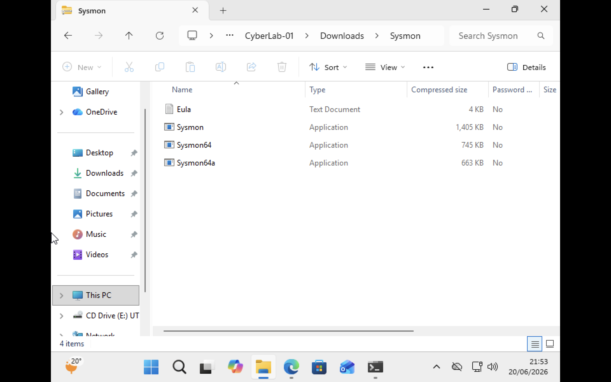
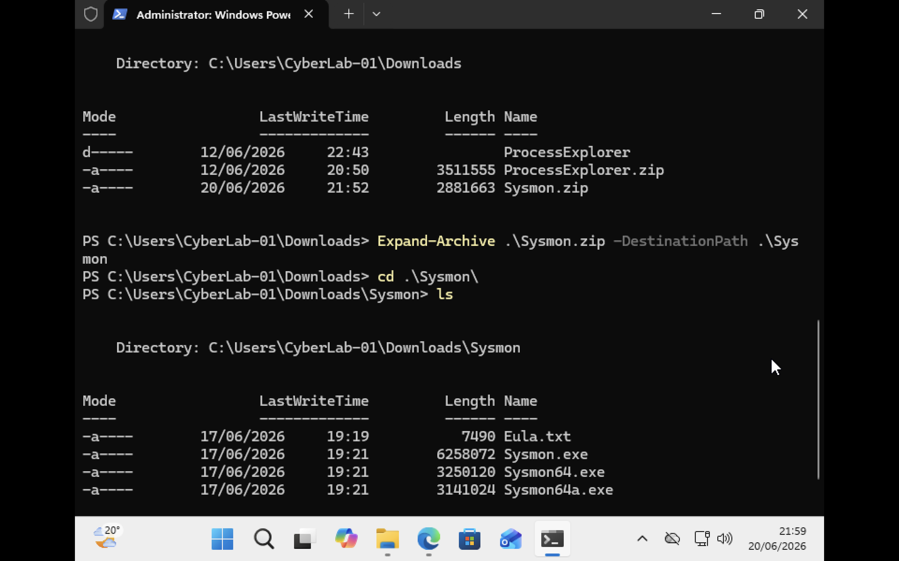
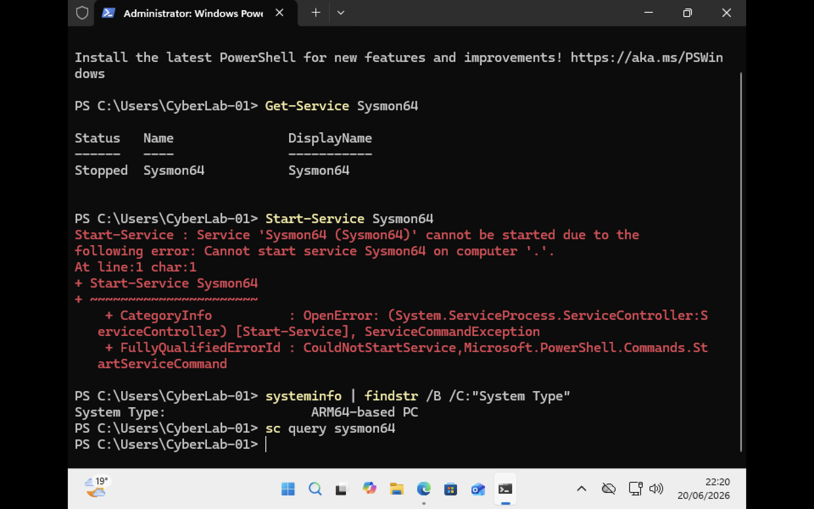

# Sysmon Behavior Analysis

## Project Overview

This project investigates the deployment and use of Microsoft Sysmon for behavioural monitoring of Windows systems. The objective was to install Sysmon within a Windows virtual machine and prepare a lab environment for behavioural monitoring and MITRE ATT&CK analysis. During the deployment process, a compatibility issue was identified and investigated. The project documents the installation process, troubleshooting steps, findings and lessons learned.

# Objectives

- Download and install Microsoft Sysmon
- Verify successful deployment
- Investigate Sysmon service behaviour
- Analyse installation issues
- Perform root cause analysis
- Document findings and lessons learned
- Prepare for future behavioural monitoring projects


# Lab Environment

| Component | Details |
|------------|-----------|
| Host System | macOS |
| Hardware | Apple Silicon MacBook Pro |
| Hypervisor | UTM |
| Guest Operating System | Windows 11 ARM64 |
| Monitoring Tool | Sysmon v15.21 |
| Shell | Windows PowerShell |


# What is Sysmon?

Sysmon (System Monitor) is a Windows system service and device driver developed by Microsoft Sysinternals.

It provides detailed telemetry that helps security analysts and defenders monitor system activity such as:

- Process creation
- Network connections
- File creation
- Driver loading
- Registry modifications
- Process injection activity

Sysmon is widely used in:

- Security Operations Centers (SOC)
- Threat Hunting
- Detection Engineering
- Digital Forensics
- Incident Response


# Step 1 – Download and Extract Sysmon

The Sysmon package was downloaded from Microsoft Sysinternals and extracted using PowerShell.


### Screenshot




The extracted package contained:

- Sysmon.exe
- Sysmon64.exe
- Sysmon64a.exe
- Eula.txt

These files represent the different Sysmon binaries required for deployment on various Windows architectures.

# Step 2 – Verify Files Using PowerShell
Following command is used to unzip the file. After extraction, PowerShell was used to verify the presence of the installation files.
### Command
```powershell
Expand-Archive .\Sysmon.zip -DestinationPath .\Sysmon
```

### Command

```powershell
cd .\Sysmon
ls
```

### Screenshot




PowerShell confirmed that all Sysmon installation files were successfully extracted and available for deployment.


# Step 3 – Install Sysmon

Sysmon was installed using the following command:

### Command

```powershell
.\Sysmon64.exe -accepteula -i
```

### Learning

The installation command:

- Accepts the Sysinternals EULA
- Installs the Sysmon service
- Installs the Sysmon kernel driver
- Creates the required Windows service

# Step 4 – Verify Service Status

After installation, the Sysmon service status was checked.

### Command

```powershell
Get-Service Sysmon64
```

### Screenshot



The service was successfully registered within Windows but remained in a stopped state.

Expected status:

```text
Running
```

Observed status:

```text
Stopped
```

# Step 5 – Attempt Manual Service Startup

A manual startup attempt was performed.

### Command

```powershell
Start-Service Sysmon64
```

### Result

The service failed to start.

PowerShell returned:

```text
Cannot start service Sysmon64.
```

# Step 6 – Security Investigation

Several troubleshooting actions were performed.

### Checks Performed

- Verified service installation
- Verified extracted binaries
- Disabled Microsoft Vulnerable Driver Blocklist
- Rebooted virtual machine
- Reinstalled Sysmon
- Attempted manual service startup
- Investigated Windows Security settings

### Result

The issue persisted despite these actions.


# Step 7 – Architecture Investigation

The system architecture was investigated to determine whether compatibility issues existed.

### Command

```powershell
systeminfo | findstr /B /C:"System Type"
```

### Result

```text
System Type: ARM64-based PC
```

### Learning

The Windows virtual machine was running:

```text
Windows 11 ARM64
```

rather than a traditional x64 installation.


# Root Cause Analysis

Sysmon relies on a kernel-mode driver to capture detailed behavioural telemetry.

Although the Sysmon service successfully installed, the required driver could not start correctly within the Windows 11 ARM64 virtual machine environment.

The issue was determined to be related to architecture compatibility rather than an installation or configuration error.


# Findings

| Finding | Status |
|----------|----------|
| Sysmon Downloaded | successful |
| Sysmon Extracted | successful|
| Installation Completed | successful |
| Service Registered | successful|
| Service Started | unsucessful|
| Telemetry Collection Available | unsucessful |
| Root Cause Identified | successful |


# Lessons Learned

This project provided practical experience with:

### Windows Administration

- Service management
- PowerShell navigation
- Software deployment

### Security Operations

- Monitoring tool installation
- Security troubleshooting
- Log investigation

### Detection Engineering

- Understanding telemetry collection
- Sysmon architecture
- Driver-based monitoring

### Troubleshooting Methodology

- Identifying symptoms
- Collecting evidence
- Testing hypotheses
- Performing root cause analysis
# Future Work

Future testing will be performed on a Windows x64 environment.

Planned activities include:

- Sysmon configuration analysis
- Event ID investigation
- Process creation monitoring
- Network connection monitoring
- MITRE ATT&CK mapping
- Detection engineering exercises
- Behavioural monitoring research

# Skills Demonstrated

- PowerShell
- Windows Administration
- Security Tool Deployment
- Troubleshooting
- Root Cause Analysis
- Security Monitoring Concepts
- Behavioural Monitoring Fundamentals
- Technical Documentation

# References

- Microsoft Sysinternals Sysmon
- Windows PowerShell Documentation
- MITRE ATT&CK Framework


## Author

**Effa Azhar**

Cybersecurity Student | SOC Analyst Enthusiast | Behavioural Monitoring Research
